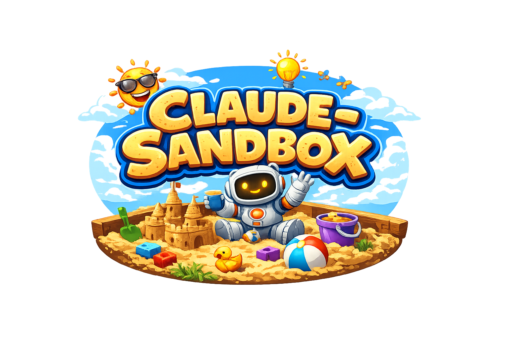

<div align="center">
  
  <p>Run Claude CLI in a containerized environment using Podman.</p>
</div>

## About

claude-sandbox wraps [Claude CLI](https://docs.anthropic.com/en/docs/claude-cli) in a Podman container with a full development toolchain. It mounts your current directory to `/workspace` and your `~/.claude` config into the container, keeping your host system clean while giving Claude access to everything it needs.

The binary handles container image pulls, self-updates, and skill updates automatically.

## Features

- **Sandboxed GitHub CLI** — proxied `gh` access with an audited allowlist of safe commands
- **Clipboard image bridge** — paste screenshots from your host into the container via `xclip`/`wl-paste`
- **Managed configuration** — ships default `CLAUDE.md` instructions while preserving your customizations
- **Per-project memory** — auto-memory is isolated per repository, not shared across all containers
- **MCP servers** — pre-configured Playwright with headless Chromium
- **Auto-updates** — binary, skills, and container image updates are checked on every launch
- **Port exposure** — forward ports from the container with `-p`

## Quick Start

Requires [Podman](https://podman.io/getting-started/installation).

Download the binary and place it in your PATH:

```bash
curl -fsSL https://github.com/nsg/claude-sandbox/releases/latest/download/claude-sandbox -o ~/bin/claude-sandbox
chmod +x ~/bin/claude-sandbox
```

Run it:

```bash
claude-sandbox
```

## Usage

```bash
# Run Claude CLI (image is pulled automatically on first run)
claude-sandbox

# Pass a prompt directly
claude-sandbox "explain this code"

# Expose ports from the container
claude-sandbox -p 8080
claude-sandbox -p 8080 -p 3000 -p 5173

# Open an interactive shell
claude-sandbox shell

# Install skills
claude-sandbox install skills
```

Use `--` to pass arguments to claude instead of claude-sandbox:

```bash
claude-sandbox -p 8080 -- -p
```

### Auto-update

Skip the interactive update prompt and update automatically:

```bash
claude-sandbox --auto-update
```

### Quiet mode

Suppress informational output, only show errors:

```bash
claude-sandbox --quiet
```

This is useful when launching from editors or scripts where stdout noise is unwanted.

### Unbuffered output

Force line-buffered stdout for the Claude process. This is auto-detected when stdin is not a TTY, but can be forced explicitly:

```bash
claude-sandbox --unbuffered
```

Without this, stdout may be fully buffered through Podman in non-TTY environments (like VS Code), causing Claude's responses to get stuck in a buffer.

### Host environment

Override environment variables for the Podman process itself (not the container). Useful when the calling environment injects unwanted paths, e.g. VS Code snap overriding `XDG_DATA_HOME`:

```bash
claude-sandbox --host-env XDG_DATA_HOME=/home/user/.local/share
```

Pass without a value to unset a variable:

```bash
claude-sandbox --host-env XDG_DATA_HOME
```

---

## GitHub CLI Proxy

The container includes a sandboxed `gh` proxy that gives Claude safe access to GitHub without exposing your credentials directly. The proxy runs on the host and communicates with the container over a Unix socket.

**Read commands** work against any repository:

| Group | Commands |
|-------|----------|
| `pr` | `list`, `view`, `diff`, `checks` |
| `issue` | `list`, `view` |
| `repo` | `view` |
| `release` | `list`, `view` |
| `run` | `list`, `view` |

**Write commands** are restricted to the workspace repository (no `--repo`/`-R` flag):

| Group | Commands |
|-------|----------|
| `pr` | `create`, `comment` |
| `issue` | `create`, `comment` |

**Extension commands** add custom functionality:

| Command | Description |
|---------|-------------|
| `gh ext run-logs <run-id>` | Download workflow run logs as a zip file |

All commands are flag-validated against a strict allowlist. Every request is logged to `.claude-sandbox/gh-proxy.log`.

Run `gh -h` inside the container to see available commands.

## Clipboard Image Bridge

Claude Code inside the container can paste images from your host clipboard. The host-side proxy finds the newest screenshot from `~/Pictures/Screenshots/` (must be less than 2 minutes old) and bridges it into the container.

Inside the container, both `xclip` and `wl-paste` are shimmed to transparently use the proxy:

```bash
# These work inside the container as Claude Code expects
xclip -selection clipboard -t image/png -o
wl-paste --type image/png
```

Set `CLIPBOARD_SCREENSHOTS_DIR` on the host to override the default screenshot directory.

## Managed Configuration

The container ships default `CLAUDE.md` instructions (skills guidance, commit conventions) that are merged into `~/.claude/CLAUDE.md` at startup using marker comments. Any content you add outside the `<!-- MANAGED START -->` / `<!-- MANAGED END -->` markers is preserved across container runs.

MCP server config (`/etc/claude/mcp.json`) is similarly merged into the project's `.mcp.json` — image defaults take precedence for shared server names, project-level config is preserved otherwise.

## Per-Project Memory

All containers mount at `/workspace`, which means Claude's auto-memory would normally be shared across every project. The entrypoint symlinks the memory directory into `.claude-sandbox/memory` inside each repository, giving every project its own isolated memory.

## Skills

Install optional Claude Code skills to `~/.claude/skills/`. Updates are checked automatically on each launch.

```bash
claude-sandbox install skills
```

| Skill | Description |
|-------|-------------|
| `/rust` | Rust development guidelines and workflow |
| `/git` | Git operations with atomic commits following conventional commit standards |
| `/github-actions` | GitHub Actions workflow development with official actions preference |
| `/readme` | README writing and maintenance guidelines |

Invoke skills manually with `/skill-name` inside Claude.

## MCP Servers

### Playwright

[Playwright MCP](https://github.com/anthropics/playwright-mcp) gives Claude a headless Chromium browser. Claude can navigate websites, take screenshots, fill forms, and interact with web pages.

Browser sessions are recorded to `.playwright-output/videos/` as `.webm` files at 1280x720.

## What's Included

The container includes:

- Claude CLI
- Node.js & npm
- Rust (via rustup) + cargo-audit
- Playwright MCP with Chromium and ffmpeg
- Zola
- Starship prompt
- Git, curl, jq, tree, build-essential, patchutils, unzip

## Building Locally

Build the container image:

```bash
make build
```

Build and install the binary:

```bash
make install
```

## License

MIT — see [LICENSE.md](LICENSE.md) for details.
